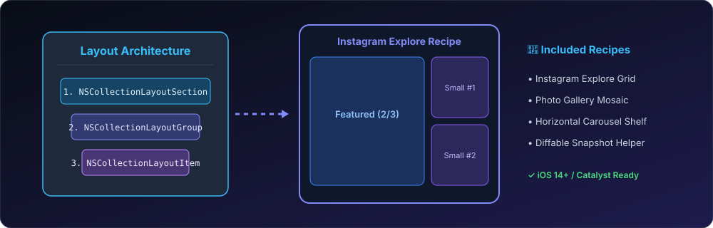

# CompositionalLayouts 🖼️

[](https://github.com/nilkanthdesai76/uicollectionview-compositional-layouts/actions)
A curated library of battle-tested `UICollectionViewCompositionalLayout` recipes (Instagram Explore grid, iPhone Gallery mosaic, Horizontal Carousel shelf) and `UICollectionViewDiffableDataSource` snapshot helpers.

[](https://swift.org)
[](https://developer.apple.com)
[](https://swift.org/package-manager/)
[](LICENSE)

<p align="center">
  
</p>

---

## 🌟 Included Recipes

1. **Instagram Explore Grid**: Alternating 2/3 featured large item + vertically stacked 1/3 pair.
2. **Horizontal Carousel Shelf**: Orthogonal paging with peek margin and centered snaps (`.groupPagingCentered`).
3. **Adaptive Photo Gallery Grid**: Uniform multi-column photo mosaic with responsive spacing.
4. **DiffableSnapshotHelper**: Clean helper utilities for animated diffable snapshot updates and in-place reconfigurations.

---

## 🚀 Installation

Add **CompositionalLayouts** via Swift Package Manager:

```swift
dependencies: [
    .package(url: "https://github.com/nilkanthdesai76/uicollectionview-compositional-layouts.git", from: "1.0.0")
]
```

---

## 💻 Quick Start

### 1. Apply Instagram Explore Layout

```swift
import UIKit
import CompositionalLayouts

let collectionView = UICollectionView(
    frame: .zero,
    collectionViewLayout: CompositionalLayoutFactory.makeInstagramExploreLayout(spacing: 2)
)
```

### 2. Apply Horizontal Carousel Shelf

```swift
let carouselLayout = CompositionalLayoutFactory.makeCarouselShelfLayout(
    itemWidthFraction: 0.85,
    itemHeight: 240,
    spacing: 16
)
```

### 3. Diffable Data Source Snapshot Helper

```swift
import CompositionalLayouts

// Apply items cleanly without boilerplate
DiffableSnapshotHelper.applySnapshot(
    dataSource: myDiffableDataSource,
    section: .main,
    items: newPosts,
    animatingDifferences: true
)
```

---

## 🧪 Testing

Run test suite via Swift CLI:

```sh
swift test
```

---

## 📄 License

This project is licensed under the MIT License - see the [LICENSE](LICENSE) file for details.
